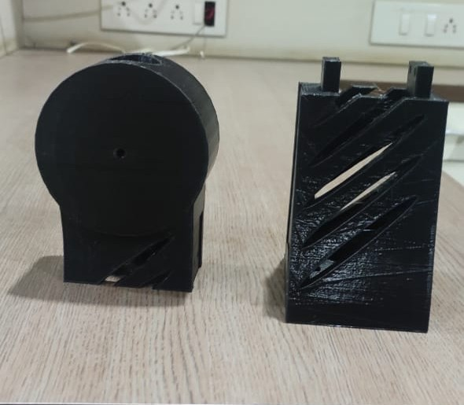
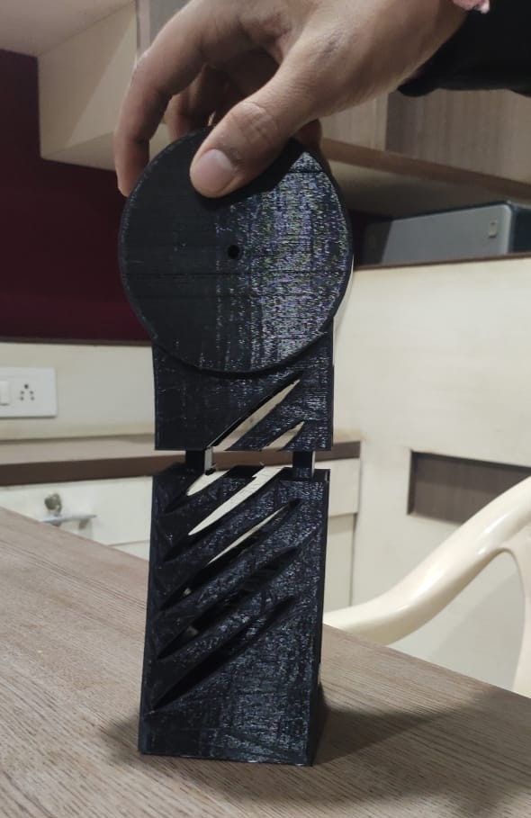
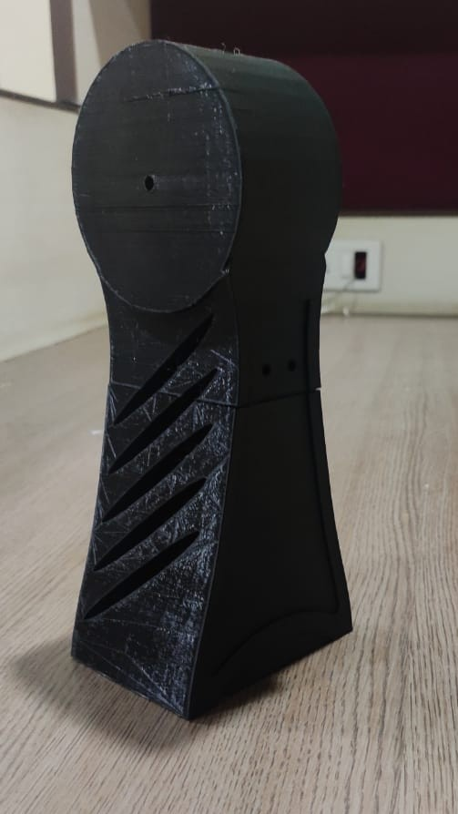
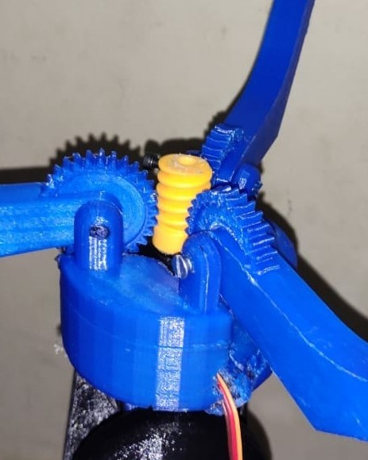
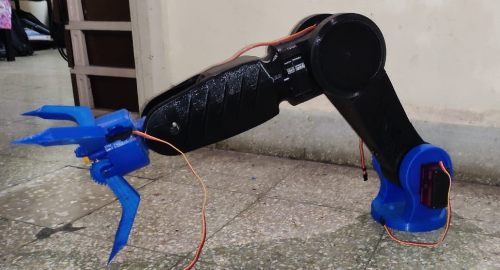
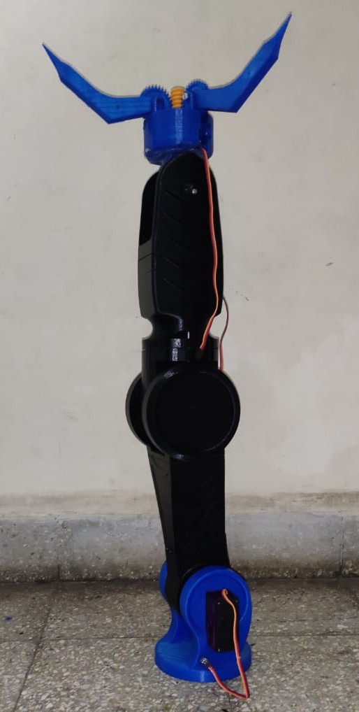

# 3D-Printed-Robotic-Arm

This repository contains of the 3D model and code for a custom design of a 5DOF robotic arm.

## Images
### 3D Printed Parts

### Assembly

    
    

### End Effector

### Final Assembly

## Videos
### Welding Operation

### Laser Cutting Operation

